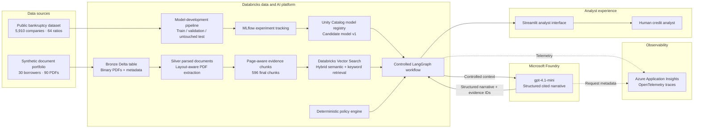
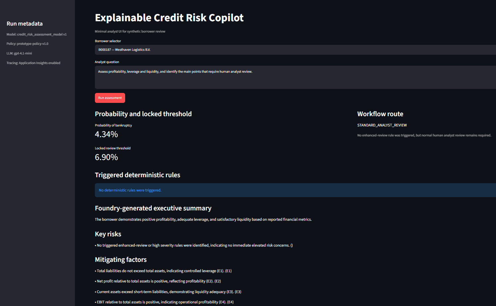

# Explainable Credit Risk Copilot

**Human-in-the-loop credit-risk decision support using Databricks, LangGraph and Microsoft Foundry**

<!-- Optional hero image -->

<!--  -->

## Overview

The Explainable Credit Risk Copilot combines a calibrated statistical model, borrower-scoped document retrieval, deterministic policy rules and a Microsoft Foundry-hosted language model to support corporate credit analysts.

The system produces:

* A calibrated probability of bankruptcy within one year
* A transparent human-review threshold
* A deterministic workflow route
* Explicitly triggered financial and document-completeness rules
* Borrower-isolated supporting document evidence
* A concise, structured and cited analyst narrative
* An auditable fallback when the LLM is unavailable

The statistical model and policy engine remain authoritative. The LLM is used only to explain existing results and retrieved evidence.

## Project status

| Capability                                     | Status      |
| ---------------------------------------------- | ----------- |
| Structured-data preparation                    | Complete    |
| Train, validation and untouched-test isolation | Complete    |
| Calibrated credit-risk model                   | Complete    |
| MLflow experiment tracking                     | Complete    |
| Unity Catalog model registration               | Complete    |
| Synthetic corporate document generation        | Complete    |
| PDF parsing and page-aware chunking            | Complete    |
| Databricks Vector Search                       | Complete    |
| Deterministic policy routing                   | Complete    |
| LangGraph orchestration                        | Complete    |
| Microsoft Foundry cited narrative              | Complete    |
| Safe LLM fallback                              | Complete    |
| Application Insights export                    | Validated   |
| Streamlit analyst interface                    | In progress |
| Full node-level production tracing             | Planned     |
| Formal GenAI evaluation suite                  | Planned     |

## Project purpose

This project demonstrates how a bank can combine traditional statistical modelling with modern generative AI without allowing the language model to make lending decisions.

The solution is designed around four separate responsibilities:

1. **Statistical model:** estimates bankruptcy probability from financial ratios.
2. **Retrieval system:** finds borrower-specific evidence in submitted documents.
3. **Policy engine:** applies transparent workflow and review rules.
4. **Generative AI:** converts authorised results and evidence into a cited analyst narrative.

This separation keeps critical decisions deterministic, testable and auditable.

## Business problem

Corporate credit analysis requires information from both structured and unstructured sources.

Structured information may include:

* Profitability ratios
* Leverage
* Liquidity
* Working capital
* Equity
* Asset turnover

Unstructured information may include:

* Loan applications
* Financial summaries
* Analyst notes
* Supporting explanations and review questions

A conventional machine-learning model can estimate risk from structured features, but it does not automatically connect its output to the relevant document evidence. A standalone language model can summarise documents, but it should not calculate risk or make lending decisions.

This project connects both approaches through a controlled workflow that:

* Calculates risk using a governed statistical model
* Restricts retrieval to one borrower
* Applies deterministic review rules
* Generates a narrative only after the model and policy results are fixed
* Requires human analyst review for every case

## Architecture



## Key design principles

### Deterministic first

The model probability, threshold, review flag and workflow route are calculated before the language model is called. The LLM cannot change them.

### Human in the loop

Every output states:

```text
human_review_required = true
automatic_lending_decision = false
```

No route creates an automatic approval or rejection.

### Borrower isolation

Vector-search queries are filtered by `borrower_id`, permitted document types and permitted financial sections. Runtime assertions detect cross-borrower retrieval.

### Evidence-grounded generation

The language model receives evidence identifiers such as `E1`, `E2` and `E3`. Python validates these identifiers and converts them back into trusted document IDs, sections and page numbers.

The LLM is not allowed to generate document metadata itself.

### Fail-safe GenAI

When Microsoft Foundry is unavailable, the workflow returns:

```text
narrative_status = UNAVAILABLE
```

The deterministic model result, policy route and retrieved evidence remain available.

### Document-completeness gate

Cases with missing or duplicate required documents are routed to:

```text
DOCUMENT_COMPLETION_REQUIRED
```

On this path:

* Vector retrieval is skipped
* Foundry narrative generation is skipped
* The final result contains no fabricated evidence

### Test-set integrity

The 30 demonstration borrowers were excluded before creating the final model-development splits. The final test set remained untouched until the model, calibration method and operating threshold were locked.

## End-to-end workflow

1. Load public company financial ratios.
2. Create leakage-free train, validation and untouched-test splits.
3. Train a logistic-regression baseline.
4. Calibrate probabilities using sigmoid calibration.
5. Select a review threshold on validation data.
6. Lock the model configuration and threshold.
7. Evaluate once on the untouched test set.
8. Register the serving-compatible model in Unity Catalog.
9. Generate synthetic borrower metadata and corporate documents.
10. Ingest the PDFs into a Bronze Delta table.
11. Parse PDFs into structured document elements.
12. Create page-aware retrieval chunks.
13. Index the chunks using Databricks Vector Search.
14. Validate the incoming borrower and analyst question.
15. Calculate the governed model result.
16. Apply deterministic document and financial rules.
17. Stop incomplete cases before retrieval.
18. Retrieve borrower-specific financial evidence for complete cases.
19. Route the case to standard or enhanced human review.
20. Generate a structured cited narrative through Microsoft Foundry.
21. Validate citations and prohibited output patterns.
22. Return a stable analyst-facing result.
23. Export operational telemetry to Application Insights.

## Data foundation

### Structured modelling dataset

The project uses the public Polish Companies Bankruptcy dataset.

| Property                   |    Value |
| -------------------------- | -------: |
| Original rows              |    5,910 |
| Financial features         |       64 |
| Original bankruptcy events |      410 |
| Original event rate        |     6.9% |
| Forecast horizon           | One year |
| Source format              |     ARFF |

The 64 anonymous source attributes were mapped to descriptive financial-ratio names.

Examples include:

* Net profit to total assets
* Total liabilities to total assets
* Working capital to total assets
* Current assets to short-term liabilities
* EBIT to total assets
* Equity to total assets
* Operating profit margin

### Clean model-development splits

The 30 borrowers used in the demonstration portfolio were excluded before the final splits were created.

| Split          |  Rows | Bankruptcy events | Event rate |
| -------------- | ----: | ----------------: | ---------: |
| Train          | 4,116 |               280 |      6.80% |
| Validation     |   882 |                60 |      6.80% |
| Untouched test |   882 |                60 |      6.80% |

There is no borrower overlap between train, validation and test.

### Synthetic document portfolio

| Property                 | Value |
| ------------------------ | ----: |
| Demonstration borrowers  |    30 |
| Documents per borrower   |     3 |
| Total PDF documents      |    90 |
| Parsed document elements | 1,346 |
| Final retrieval chunks   |   596 |
| Missing files            |     0 |
| Empty files              |     0 |
| Duplicate document IDs   |     0 |

Each borrower has:

* Corporate loan application
* Financial summary
* Preliminary credit analyst note

Company names, loan information and narratives are synthetic. Financial ratios originate from the public modelling dataset.

## Model development

### Model

The final prototype uses:

* Logistic regression
* Median imputation fitted on training data only
* Feature scaling
* Sigmoid probability calibration
* A validation-selected review threshold
* A serving-compatible MLflow PyFunc wrapper

The threshold is intended to route cases for human review—not to approve or reject credit.

### Final untouched-test results

The model and review threshold were locked before opening the final test set.

| Metric                     | Final test result |
| -------------------------- | ----------------: |
| ROC-AUC                    |        **0.9087** |
| PR-AUC                     |        **0.6234** |
| Brier score                |        **0.0552** |
| Base-rate Brier score      |            0.0634 |
| Log loss                   |        **0.2056** |
| Base-rate log loss         |            0.2485 |
| Precision                  |            0.3145 |
| Recall                     |        **0.8333** |
| F1 score                   |            0.4566 |
| Balanced accuracy          |            0.8504 |
| Review rate                |            18.03% |
| Event rate                 |             6.80% |
| Mean predicted probability |             6.74% |
| Calibration gap            |           -0.0006 |

Locked operating threshold:

```text
0.068990
```

Final confusion matrix:

|              | Predicted below threshold | Referred for review |
| ------------ | ------------------------: | ------------------: |
| Non-bankrupt |                       713 |                 109 |
| Bankrupt     |                        10 |                  50 |

The chosen operating point prioritises recall because the model is used to refer potentially risky cases for human assessment.

## Model governance

The registered model is stored in Unity Catalog as:

```text
demodatabrciks123.creditrisk.credit_risk_assessment_model
```

Registered version:

```text
Version 1
Alias: Candidate
```

The model returns:

```json
{
  "probability_of_bankruptcy": 0.138282,
  "review_threshold": 0.068990,
  "review_required": true,
  "decision_support_status": "REFER_FOR_HUMAN_REVIEW"
}
```

The output deliberately avoids automatic approval, rejection or pricing recommendations.

## Document retrieval

Documents are processed through three main stages.

### Bronze

The Bronze table preserves:

* Binary PDF content
* Document ID
* Borrower ID
* Document type
* File path
* File size
* SHA-256 content hash
* Ingestion timestamp
* PDF-header validation

### Silver parsing

The PDFs are parsed into layout-aware elements including:

* Titles
* Section headers
* Text
* Tables
* Page numbers
* Extraction confidence
* Bounding-box metadata

All 90 documents were parsed successfully.

### Retrieval chunks

The final chunking process:

* Preserves original HTML tables for analyst evidence
* Creates clean text for embeddings
* Carries document-title and section context
* Stores one-based page numbers
* Removes page footers and standalone headings
* Enables Change Data Feed
* Produces unique chunk identifiers

The final index contains 596 chunks.

Retrieval is restricted to:

```text
Document types:
- financial_summary
- credit_analyst_note

Sections:
- Selected financial ratios
- Objective financial observations
- Observed financial points
```

Queries use hybrid semantic and keyword retrieval.

## Deterministic policy routing

The policy engine applies prototype workflow rules.

Possible routes:

```text
DOCUMENT_COMPLETION_REQUIRED
ENHANCED_ANALYST_REVIEW
STANDARD_ANALYST_REVIEW
```

Example rule categories include:

* Document completeness
* Document integrity
* Model risk signal
* Balance-sheet weakness
* Liquidity weakness
* Profitability weakness

The rules are explicit Python logic and are not generated by the LLM.

Example enhanced-review case:

```text
Borrower: B005638
Probability: 0.1383
Review threshold: 0.0690
Workflow route: ENHANCED_ANALYST_REVIEW
Triggered rules: 5
```

## LangGraph orchestration

The workflow uses an explicit state machine.

```mermaid
flowchart TD
    START([Start]) --> VALIDATE["Validate request"]
    VALIDATE --> POLICY["Run model and deterministic policy"]

    POLICY -->|"Missing or duplicate documents"| BLOCK["Document completion required"]
    BLOCK --> FINAL["Finalise result"]

    POLICY -->|"Complete case"| RETRIEVE["Retrieve borrower-scoped evidence"]

    RETRIEVE -->|"Enhanced route"| ENHANCED["Enhanced analyst review"]
    RETRIEVE -->|"Standard route"| STANDARD["Standard analyst review"]

    ENHANCED --> SUMMARY["Generate cited Foundry narrative"]
    STANDARD --> SUMMARY

    SUMMARY --> FINAL
    FINAL --> END([End])
```



The document-completion route does not call Vector Search or Microsoft Foundry.

## Microsoft Foundry narrative

The project calls a Microsoft Foundry-hosted Azure OpenAI deployment:

```text
gpt-4.1-mini
```

The LLM receives only:

* Analyst question
* Authoritative model result
* Authoritative policy result
* Borrower-filtered evidence
* Fixed human-review instructions

It returns a strict structured object containing:

```text
executive_summary
key_risk_factors
mitigating_factors
analyst_review_actions
limitations
```

Every risk or mitigating finding must reference one or more supplied evidence IDs.

Python then validates those IDs and enriches them with trusted document and page metadata.

### Safe-failure behaviour

A deliberately invalid deployment produced:

```text
narrative_status: UNAVAILABLE
error_type: NotFoundError
narrative: None
citations: 0
```

The graph still retained the deterministic assessment, policy route and retrieved evidence.

## Risk and governance controls

| Control                       | Implementation                                         |
| ----------------------------- | ------------------------------------------------------ |
| No automatic lending decision | Fixed output contract and policy disclaimer            |
| Human review                  | Required for every workflow route                      |
| Test leakage prevention       | Demonstration borrowers excluded before final split    |
| Training-only preprocessing   | Imputation fitted on train data only                   |
| Locked threshold              | Selected on validation and frozen before test          |
| Borrower isolation            | Vector-search filter plus runtime assertions           |
| Document completeness         | Blocking route before retrieval                        |
| Citation validation           | Evidence IDs mapped to trusted metadata in Python      |
| Prompt-injection protection   | Documents treated as untrusted evidence                |
| Hidden-label exclusion        | Outcome labels are not supplied to policy or LLM       |
| Safe LLM failure              | `UNAVAILABLE` fallback preserves deterministic result  |
| Secret management             | Databricks secret scopes                               |
| Synthetic document disclosure | Included in documents, outputs and UI                  |
| Observability privacy         | Prompt and document content excluded from custom spans |

## Technology stack

| Area                   | Technology                                      |
| ---------------------- | ----------------------------------------------- |
| Data processing        | Python, pandas, PySpark                         |
| Storage                | Databricks Volumes, Delta Lake                  |
| Governance             | Unity Catalog                                   |
| PDF parsing            | Databricks `ai_parse_document`                  |
| Vector retrieval       | Databricks Vector Search                        |
| Embeddings             | `databricks-gte-large-en`                       |
| Model development      | scikit-learn                                    |
| Experiment tracking    | MLflow                                          |
| Model registry         | Unity Catalog Models                            |
| Workflow orchestration | LangGraph                                       |
| Generative AI          | Microsoft Foundry, Azure OpenAI, `gpt-4.1-mini` |
| Structured outputs     | OpenAI Responses API, Pydantic                  |
| Observability          | OpenTelemetry, Azure Application Insights       |
| Analyst interface      | Streamlit                                       |
| Source control         | GitHub                                          |

## Analyst interface

The Streamlit interface is designed to let an analyst:

1. Select a synthetic borrower.
2. Enter an assessment question.
3. Run the controlled LangGraph workflow.
4. Inspect probability and locked review threshold.
5. Review the deterministic workflow route.
6. Examine triggered rules.
7. Read the Foundry-generated narrative.
8. Open trusted document citations.
9. Confirm that human review remains required.

### Enhanced-review example



### Standard-review example


### Document-completion example


## Observability

Application Insights is connected through Azure Monitor OpenTelemetry.

The Databricks telemetry smoke test successfully exported:

```text
Span: credit_risk_copilot.telemetry_smoke_test
Table: dependencies
Success: true
Content recorded: false
```


The current implementation proves that Databricks can export custom spans to the connected Application Insights resource.

Full node-level workflow tracing is planned for a later version.

## Repository structure

```text
.
├── app/
│   ├── app.py
│   ├── app.yaml
│   ├── requirements.txt
│   └── src/
│
├── data_preparation/
│   └── credit_risk_copilot_data_preparation
│
├── model_training/
│   └── credit_risk_baseline_model_training
│
├── notebooks/
│   ├── 00_bootstrap
│   ├── 10_runtime_config
│   ├── 15_foundry_connection_test
│   ├── 20_retrieval_tool
│   ├── 30_credit_risk_model_tool
│   ├── 40_policy_tool
│   ├── 50_langgraph_workflow
│   ├── 55_foundry_summary_tool
│   ├── 57_tracing_setup
│   ├── 60_smoke_tests
│   └── 70_store_application_insights_secret
│
├── docs/
│   ├── architecture/
│   └── screenshots/
│
├── runtime_configuration.example.json
├── requirements.txt
├── .gitignore
├── LICENSE
└── README.md
```

## Running the project

### Prerequisites

* Databricks workspace
* Unity Catalog-enabled catalog and schema
* Databricks Vector Search
* Microsoft Foundry project
* Deployed `gpt-4.1-mini` model
* Azure Application Insights resource
* Python 3.12-compatible runtime

### Required Databricks secrets

Create the scope:

```text
credit-risk-copilot
```

Required keys:

```text
foundry-api-key
application-insights-connection-string
```

Never store the values in GitHub.

### Step 1: Prepare the data

Run:

```text
Credit Risk Copilot Data Preparation
```

This creates:

* Clean financial data
* Leakage-free model splits
* Synthetic demonstration cohort
* Synthetic PDF documents
* Bronze and Silver Delta tables
* Page-aware chunks
* Vector Search index

### Step 2: Train and register the model

Run:

```text
Credit Risk Baseline Model Training
```

This performs:

* Model training
* Probability calibration
* Validation threshold selection
* Untouched-test evaluation
* MLflow logging
* Unity Catalog registration

### Step 3: Configure runtime values

Copy:

```text
runtime_configuration.example.json
```

to the protected runtime location and update only non-secret values such as:

* Catalog and schema
* Vector Search endpoint
* Vector Search index
* Model name and alias
* Foundry endpoint
* Foundry deployment
* Secret-scope names

### Step 4: Start the workflow

Run:

```text
notebooks/00_bootstrap
```

The bootstrap notebook:

* Installs pinned dependencies
* Restarts Python once
* Loads runtime configuration
* Loads retrieval, model, policy and Foundry tools
* Configures telemetry
* Compiles the LangGraph workflow

A cold-start test confirmed that the project does not depend on hidden notebook state.

### Step 5: Run smoke tests

Run manually:

```text
notebooks/60_smoke_tests
```

The smoke suite covers:

* Standard analyst-review route
* Enhanced analyst-review route
* Document-completion route
* Borrower-isolated evidence retrieval
* Cited Foundry output
* Safe Foundry failure
* Application Insights export

Some tests make paid Foundry requests and are intentionally excluded from automatic bootstrap execution.

### Optional diagnostic notebooks

```text
15_foundry_connection_test
```

Tests the Foundry endpoint, deployment and secret.

```text
70_store_application_insights_secret
```

Securely stores the Application Insights connection string. It must never contain a hard-coded secret and must not run automatically.

## Launching the Streamlit interface

From the application directory:

```bash
streamlit run app.py
```

For Databricks Apps, deploy the contents of the `app/` directory using the configured `app.yaml` and `requirements.txt`.

The deployed application must have access to:

* Required Unity Catalog objects
* Vector Search endpoint
* Registered model
* Databricks secret scope
* Microsoft Foundry endpoint

## Security

The repository must not contain:

* Azure OpenAI API keys
* Application Insights connection strings
* Databricks access tokens
* Secret-scope values
* Real borrower information
* Real bank lending policies
* Local `.env` files
* Workspace-specific authentication files

The `.gitignore` should exclude:

```text
.env
.env.*
runtime_configuration.json
*.key
*.pem
secrets/
.DS_Store
__pycache__/
.ipynb_checkpoints/
```

If a credential is ever committed, deleting the file in a later commit is insufficient. The credential should be rotated and removed from Git history.

## Known limitations

* The model is trained on a public bankruptcy dataset rather than bank-specific corporate-default data.
* Company metadata and supporting documents are synthetic.
* The 30-borrower portfolio is designed for demonstration, not statistical validation.
* Prototype rules are not NIBC or any other bank’s lending policy.
* No fairness, bias or protected-class analysis has been completed.
* The prototype does not produce regulatory adverse-action reasons.
* Model serving was unavailable on the trial Databricks workspace.
* The registered Unity Catalog model is therefore loaded directly by the notebook workflow.
* Current Application Insights integration validates telemetry export, but full node-level tracing is not yet implemented.
* Formal groundedness, relevance and completeness evaluations are planned.
* API-key authentication should be replaced with workload identity for production.
* The system has not undergone production security, penetration or operational-resilience testing.

## Future improvements

* Add node-level parent and child OpenTelemetry spans.
* Build a formal GenAI evaluation dataset.
* Measure groundedness, relevance and response completeness.
* Add citation precision and citation recall metrics.
* Deploy the model through Databricks Model Serving.
* Replace API keys with service-principal or managed-identity authentication.
* Add model drift and calibration monitoring.
* Add data-quality expectations to ingestion pipelines.
* Add fairness and segment-level performance analysis.
* Add configurable policy rules with version control.
* Add CI/CD for notebooks, tests and the Streamlit application.
* Deploy the Streamlit interface through Databricks Apps.
* Add analyst feedback and case-review history.
* Add automated document-version and lineage validation.

## Disclaimer

This repository is an independent portfolio project.

It is not affiliated with, endorsed by, or developed for financial institution.

All company names, loan applications, analyst notes and narrative content are synthetic. Model outputs are for demonstration and educational purposes only.

The system does not approve, reject, price or otherwise make a lending decision. Human analyst review is mandatory.
