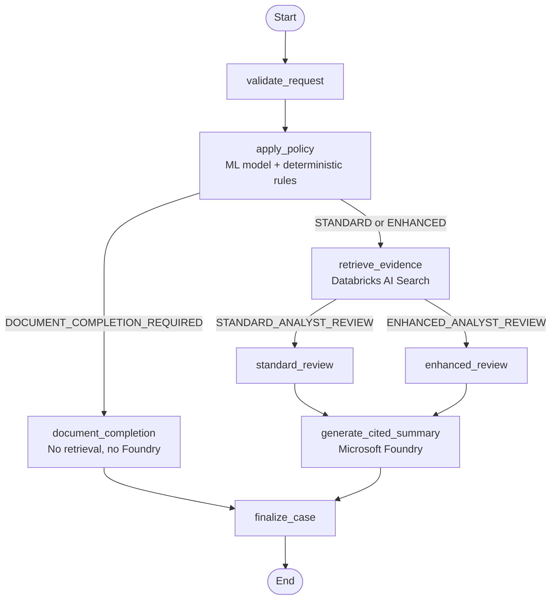

<a id="top"></a>

# Explainable Credit Risk Copilot

### General Technical Guide & Reference Architecture

[](#project-scope-and-safety)
[](#project-scope-and-safety)
[](#17-what-is-retrieval-doing)
[](#27-what-is-langgraph-doing)
[](#34-platform-choices-and-reasons)

> [!NOTE]
> This guide explains the project from first principles for developers, data scientists, architects, reviewers, and GitHub readers. It is designed as a reusable technical reference that is not tailored to any single organization or implementation context.

> [!CAUTION]
> This project is a **portfolio prototype**. It does not represent any financial institution's lending policy, does not approve or reject loans, and must not be used for real credit decisions.

## Quick navigation

| Area | What you will learn |
|---|---|
| [Mental model](#1-the-simplest-mental-model) | What the system does from borrower selection to cited explanation |
| [Problem and scope](#2-what-problem-does-the-project-solve) | Why ML, deterministic rules, retrieval, and an LLM are separated |
| [Data and modelling](#4-dataset-what-it-is-and-what-one-row-means) | Dataset structure, leakage prevention, calibration, thresholding, and metrics |
| [Synthetic document portfolio](#15-why-create-a-synthetic-30-borrower-portfolio) | How structured rows were aligned with generated PDFs |
| [Retrieval and RAG](#17-what-is-retrieval-doing) | Chunking, hybrid search, metadata filters, and evidence grounding |
| [LLM controls](#23-what-does-microsoft-foundry-do) | Prompt design, structured output, and citation validation |
| [Workflow orchestration](#27-what-is-langgraph-doing) | Conditional graph routing and safe stopping conditions |
| [UI examples](#30-what-does-the-ui-show) | How to interpret standard and enhanced review cases |
| [Governance](#35-key-governance-controls) | Controls for leakage, hallucination, privacy, and human review |
| [FAQ](#38-common-technical-questions-and-strong-answers) | Concise answers to common architecture and modelling questions |
| [Limitations](#40-known-limitations) | Current boundaries and production improvements |

## At a glance

```text
Structured financial ratios
        ↓
Calibrated bankruptcy-risk model
        ↓
Locked threshold + deterministic policy rules
        ↓
Borrower-scoped document retrieval
        ↓
Controlled LLM-generated explanation with evidence IDs
        ↓
Python validation + human analyst review
```

### Project scope and safety

- **Model purpose:** produce a bankruptcy-risk signal from public financial-ratio data.
- **Workflow purpose:** route cases to standard or enhanced human review.
- **LLM purpose:** explain fixed model and policy outputs using retrieved evidence.
- **Non-goal:** automate loan approval, rejection, or any legally significant decision.
- **Data status:** public structured data plus synthetic company metadata and documents.

---

## 1. The simplest mental model

When the analyst selects a borrower in the UI, the system does four things:

```text
1. Score the borrower with a statistical model
2. Route the case with deterministic rules
3. Retrieve borrower-specific document evidence
4. Ask Microsoft Foundry to write a cited human-readable summary
```

A simple version of the workflow is:

```text
Borrower ID
   ↓
Structured financial ratios
   ↓
Bankruptcy probability from ML model
   ↓
Compare probability with locked review threshold
   ↓
Apply deterministic policy rules
   ↓
If documents are complete:
      retrieve evidence from PDFs
      pass evidence + model result + policy result to LLM
      generate cited analyst narrative
If documents are missing:
      skip retrieval and skip LLM
      ask for document completion
```

The important design point is:

> The **ML model and deterministic rules decide the numerical risk signal and workflow route**.  
> The **LLM only explains the already-fixed result using retrieved evidence**.

---

## 2. What problem does the project solve?

Corporate credit analysis is not only a modelling problem. A human analyst usually needs to combine:

- structured financial ratios;
- credit-risk or bankruptcy-risk scores;
- submitted documents;
- analyst notes;
- policy checks;
- explanations that can be reviewed and challenged.

A normal ML model can produce a probability, but it does not explain the result with document evidence.

A standalone LLM can write fluent text, but it should not make a lending decision or invent financial facts.

This project combines both safely:

```text
Traditional model → reliable numerical signal
RAG retrieval     → borrower-specific evidence
Policy rules      → deterministic workflow control
Foundry LLM       → cited human-readable explanation
LangGraph         → controlled orchestration
Streamlit UI      → analyst-facing interface
```

---

## 3. Credit risk vs bankruptcy prediction

This project uses a **public bankruptcy dataset** as a proxy for a corporate credit-risk workflow.

That distinction is important.

The project does **not** use real bank loan data. Real institutional default data is generally not publicly available. Instead, the model predicts whether a company belongs to the **bankrupt-within-one-year** class using financial ratios.

Reusable explanation:

> I used public bankruptcy prediction data as a realistic proxy for corporate credit-risk modelling. The model predicts one-year bankruptcy risk, and I use that signal to demonstrate how a bank-style workflow could combine structured risk modelling, document retrieval, and controlled GenAI explanation.

Do **not** say:

```text
The project directly predicts a bank's internal credit-risk outcome.
```

Say:

```text
The model predicts one-year bankruptcy probability using public company financial ratios. I use that as a proxy for corporate credit-risk decision support.
```

---

## 4. Dataset: what it is and what one row means

The source dataset is the **Polish Companies Bankruptcy dataset** from the UCI Machine Learning Repository.

The dataset contains company financial ratios and a binary bankruptcy label. UCI describes it as a classification dataset about bankruptcy prediction of Polish companies. Bankrupt companies were analysed from 2000–2012 and still-operating companies from 2007–2013.[^uci]

The dataset contains five ARFF files:

```text
1year.arff
2year.arff
3year.arff
4year.arff
5year.arff
```

In this project, I used:

```text
5year.arff
```

The name **5year** can be confusing. It does not simply mean “data from calendar year five.” UCI describes the 5thYear file as containing financial ratios from the 5th year of the forecasting period, with a class label indicating bankruptcy status after **1 year**.[^uci]

For the file used in this project:

```text
Rows: 5,910 financial statements
Features: 64 financial ratios
Target: binary bankruptcy label
Bankrupt companies: 410
Non-bankrupt companies: 5,500
Event rate: 6.9%
```

So one row means approximately:

```text
Company financial statement at a given observation point
→ 64 financial ratios
→ label: did this company go bankrupt within the next year?
```

The target is binary:

```text
0 = solvent / non-bankrupt
1 = bankrupt
```

---

## 5. What does the raw data look like?

The raw ARFF file contains anonymous-looking columns:

```text
Attr1, Attr2, Attr3, ..., Attr64, class
```

The target column is:

```text
class
```

The 64 feature columns are financial ratios, for example:

```text
net profit / total assets
total liabilities / total assets
working capital / total assets
current assets / short-term liabilities
EBIT / total assets
equity / total assets
sales / total assets
operating profit margin
```

---

## 6. How did we rename anonymous features?

The feature names were **not invented**.

The UCI dataset documentation provides the official ordered variable definitions from `X1` to `X64`.[^uci] The ARFF file uses `Attr1` to `Attr64`.

I mapped them by position:

```text
Attr1  → X1  → net_profit_to_total_assets
Attr2  → X2  → total_liabilities_to_total_assets
Attr3  → X3  → working_capital_to_total_assets
Attr4  → X4  → current_assets_to_short_term_liabilities
...
Attr64 → X64 → sales_to_fixed_assets
```

This means the naming logic is documented and reproducible.

Reusable explanation:

> The raw ARFF file uses anonymous attribute names, but the UCI documentation provides the ordered definitions from X1 to X64. I renamed the columns by position: Attr1 maps to X1, Attr2 to X2, and so on. I did not infer the names from the values.

---

## 7. Why data leakage matters

A key modelling principle in this project was:

> Split first, then fit preprocessing only on the training set.

The wrong approach would be:

```text
Fit imputer/scaler on the full dataset
→ split into train/test
```

That leaks information from validation/test into training.

The correct approach used here was:

```text
1. Split data first.
2. Fit missing-value imputer only on train.
3. Fit scaler only on train.
4. Train model only on train.
5. Use validation to choose threshold.
6. Use untouched test only once at the end.
```

This matters because even something simple like a median imputation value can leak test-set distribution information if computed on the full dataset.

---

## 8. Train, validation, and test design

The final clean split excluded the 30 demo borrowers first, then created train, validation, and test sets.

Final split:

| Split | Rows | Bankrupt | Event rate |
|---|---:|---:|---:|
| Train | 4,116 | 280 | 6.80% |
| Validation | 882 | 60 | 6.80% |
| Test | 882 | 60 | 6.80% |

Why this matters:

- **Train** is used to fit preprocessing and model parameters.
- **Validation** is used to choose operating threshold.
- **Test** is kept untouched until the end to estimate generalisation.

Reusable explanation:

> I used a train-validation-test design. The threshold was selected on validation, then frozen. The test set was opened once after model configuration and threshold were locked.

---

## 9. Why logistic regression?

I used logistic regression intentionally.

The reason was not that logistic regression is always the most powerful model. The reason was that this project emphasises:

- explainability;
- calibrated probabilities;
- reproducible baseline modelling;
- integration with governance and human review;
- a simple model that technical and non-technical stakeholders can understand quickly.

Logistic regression is a strong baseline for this type of project because it outputs probabilities and is easier to explain than a black-box ensemble.

Reusable explanation:

> I chose logistic regression as an explainable baseline. The project focus was not only predictive performance, but also calibration, threshold selection, retrieval grounding, governance, and human-in-the-loop design.

---

## 10. What does the model predict?

The model predicts:

```text
probability_of_bankruptcy
```

Example:

```text
Borrower: B000187
Probability of bankruptcy: 4.34%
```

Meaning:

> Based on this borrower’s financial ratios, the model estimates a 4.34% probability that this company belongs to the bankrupt-within-one-year class.

It does **not** mean:

```text
Approve the loan
Reject the loan
The company will certainly fail
```

It only creates a risk signal for human review.

---

## 11. Why define a threshold?

A probability alone is not enough to drive a workflow.

The model outputs a continuous probability:

```text
4.34%
5.85%
13.83%
```

But the application needs a practical routing decision:

```text
Below threshold → standard analyst review
Above threshold → enhanced analyst review
```

The locked threshold is:

```text
6.90%
```

The basic rule is:

```text
if probability_of_bankruptcy >= 6.90%:
    REFER_FOR_HUMAN_REVIEW
else:
    BELOW_REVIEW_THRESHOLD
```

Example 1:

```text
B000187 probability = 4.34%
threshold = 6.90%

4.34% < 6.90%
→ model-risk flag is not triggered
→ STANDARD_ANALYST_REVIEW, if no other rules trigger
```

Example 2:

```text
B005638 probability = 13.83%
threshold = 6.90%

13.83% > 6.90%
→ model-risk flag is triggered
→ ENHANCED_ANALYST_REVIEW
```

Important:

> The threshold does not approve or reject credit. It only decides whether the case needs enhanced human review.

---

## 12. How was the threshold selected?

The threshold was selected on the validation set.

The project logic was:

> In a credit-risk style screening workflow, missing risky companies can be more costly than sending too many cases for review. Therefore, recall is important.

I selected a threshold that achieved about **80% recall** on validation while keeping the review rate manageable.

Validation result around the locked operating point:

```text
Selected threshold: 0.0690
Validation recall: about 80%
Validation precision: about 27.6%
Validation review rate: about 19.7%
```

Then the threshold was frozen and evaluated on the untouched test set.

---

## 13. Did we calibrate probabilities?

Yes.

The project used **sigmoid calibration** after the base logistic regression pipeline.

Why calibration matters:

A model can rank risky companies well but still produce poor probabilities. For a risk workflow, the probability itself should be meaningful.

Example of an uncalibrated problem:

```text
Model says: 20% risk
Reality among similar cases: 8% fail
```

That is a ranking signal, but not a reliable probability.

Calibration tries to make the predicted probability better aligned with observed frequencies.

In this project:

- logistic regression produced ranking and probability outputs;
- sigmoid calibration improved probability quality;
- Brier score and log loss were used to evaluate probability quality.

The calibrated model improved validation probability quality compared with the uncalibrated version:

```text
Uncalibrated Brier score: 0.1105
Sigmoid-calibrated Brier score: 0.0555

Uncalibrated log loss: 0.4162
Sigmoid-calibrated log loss: 0.2063
```

Reusable explanation:

> I calibrated the model because the output is used as a probability, not only as a ranking score. Calibration improved Brier score and log loss, which measure probability quality.

---

## 14. Final model results

> [!TIP]
> Read these metrics together: ranking quality, probability quality, recall, precision, and operational review rate answer different questions.

After locking the model and threshold, the test set was evaluated once.

Final untouched-test results:

| Metric | Value |
|---|---:|
| ROC-AUC | 0.9087 |
| PR-AUC | 0.6234 |
| Brier score | 0.0552 |
| Log loss | 0.2056 |
| Precision | 0.3145 |
| Recall | 0.8333 |
| F1 | 0.4566 |
| Balanced accuracy | 0.8504 |
| Review rate | 18.03% |
| Event rate | 6.80% |
| Mean predicted probability | 6.74% |
| Calibration gap | -0.0006 |

Final confusion matrix:

| Actual / Predicted | Below threshold | Referred for review |
|---|---:|---:|
| Non-bankrupt | 713 | 109 |
| Bankrupt | 10 | 50 |

Interpretation:

- The model captured 50 out of 60 bankrupt cases.
- It missed 10 bankrupt cases.
- It sent about 18% of test cases for review.
- Precision is moderate because the minority class is rare, but recall is strong.

Reusable explanation:

> The model is not a final credit decision engine. It is a screening component that prioritises recall and routes potentially risky cases for human review.

---

## 15. Why create a synthetic 30-borrower portfolio?

The original dataset contains structured rows only. It does not include PDFs, loan applications, analyst notes, or company narratives.

To demonstrate more than standalone model training, the prototype also includes:

- Databricks-based data engineering;
- modern cloud architecture;
- retrieval-augmented generation;
- Microsoft Foundry model deployment;
- LangChain / LangGraph orchestration;
- production-oriented data and AI workflows.

So I created a small portfolio to demonstrate an end-to-end banking-style AI solution:

```text
structured model
+ synthetic credit documents
+ retrieval
+ LLM-generated cited explanation
+ analyst UI
```

Why 30 borrowers?

This is a portfolio prototype, not a production dataset. 30 borrowers is enough to demonstrate different workflow paths:

```text
10 healthy solvent borrowers
10 stressed solvent borrowers
10 bankrupt borrowers
```

This gives examples of:

- standard review;
- enhanced review;
- strong positive evidence;
- strong negative evidence;
- different rule triggers.

The 30 demo borrowers were excluded from final training/validation/test splits to avoid leakage in the model pipeline.

---

## 16. How were the PDFs synthesized?

For each of the 30 demo borrowers, I generated three PDFs:

```text
1. loan_application.pdf
2. financial_summary.pdf
3. credit_analyst_note.pdf
```

### 16.1 Loan application PDF

Contains synthetic business/application metadata:

```text
company name
sector
country
employee count
requested loan amount
loan purpose
requested term
repayment frequency
```

This information is synthetic.

### 16.2 Financial summary PDF

Contains financial ratios derived from the selected borrower’s actual structured row.

Example:

```text
Net profit / total assets
Total liabilities / total assets
Working capital / total assets
Current assets / short-term liabilities
EBIT / total assets
Equity / total assets
Sales / total assets
Operating profit margin
```

This is aligned with the actual financial-ratio row.

### 16.3 Credit analyst note PDF

Contains objective observations derived from financial facts.

Example for a healthy borrower:

```text
Net profit relative to total assets is positive.
EBIT relative to total assets is positive.
Working capital relative to total assets is non-negative.
Current assets exceed short-term liabilities.
Reported total liabilities do not exceed total assets.
```

Example for a stressed borrower:

```text
Net profit relative to total assets is negative.
EBIT relative to total assets is negative.
Working capital relative to total assets is negative.
Current assets are below short-term liabilities.
Reported total liabilities exceed total assets.
```

### 16.4 Why three PDFs?

The three PDFs simulate a realistic credit-review file:

```text
loan_application      → what the borrower requested
financial_summary     → key financial ratios
credit_analyst_note   → objective review observations
```

The idea is to show how the model score can be connected to document evidence.

Reusable explanation:

> The synthetic documents are not random text. The company metadata is synthetic, but the financial observations are generated from the selected borrower’s actual financial-ratio row. That keeps the structured data and document narrative aligned.

---

## 17. What is retrieval doing?

Retrieval searches the indexed document chunks for evidence relevant to the analyst question.

Example analyst question:

```text
Assess profitability, leverage and liquidity.
```

The retrieval system searches for evidence related to:

```text
profitability
net profit
EBIT
leverage
liabilities
equity
liquidity
working capital
current assets
short-term liabilities
```

In this project, retrieval is implemented with **Databricks AI Search**. Databricks AI Search is a vector search solution built into the Databricks Data Intelligence Platform and used for retrieval in RAG applications.[^databricks-ai-search]

---

## 18. What is hybrid search?

Hybrid search combines:

```text
1. Vector search
   Finds semantically similar evidence.

2. Keyword search
   Finds exact financial terms and identifiers.
```

This matters because financial questions often contain exact terms such as:

```text
EBIT
working capital
short-term liabilities
equity
```

Pure vector search might understand semantic meaning, but exact financial terminology still matters.

Databricks AI Search supports hybrid keyword-similarity search, combining vector-based embedding search with keyword search and metadata filters.[^databricks-ai-search]

Reusable explanation:

> I used hybrid search because credit documents contain both semantic concepts and exact financial terms. Vector search captures meaning, while keyword search helps with exact terms like EBIT or working capital.

---

## 19. Did we chunk the PDFs?

Yes.

The PDFs were parsed and chunked before indexing.

But the project did **not** use arbitrary fixed-size chunking like:

```text
500 tokens with 100-token overlap
```

Instead, it used **layout-aware element chunking**.

The process:

```text
1. Parse PDFs into document elements.
2. Extract meaningful text and table elements.
3. Preserve document ID, borrower ID, document type, section, and page number.
4. Remove page footers and page-number noise.
5. Treat each meaningful paragraph or table as a chunk.
6. Enrich embedding text with company, document type, section, page, and content.
```

Example chunk text for embedding:

```text
Company: Westhaven Logistics B.V.
Document type: financial summary
Document title: Financial Summary
Section: Selected financial ratios
Page: 1
Net profit / total assets: 0.553
Total liabilities / total assets: 0.069
Working capital / total assets: 0.887
Current assets / short-term liabilities: 14.026
EBIT / total assets: 0.683
Equity / total assets: 0.931
```

Why no overlap?

The PDFs are short and structured. A paragraph or table already forms a natural evidence unit. Adding overlap would duplicate evidence and make citations less clean.

Reusable explanation:

> I used document-structure-based chunking rather than fixed token windows. Because the PDFs were short and structured, each table or paragraph became an evidence chunk. I preserved page and section metadata so the final answer could cite the source.

---

## 20. What was indexed?

The final chunk table had:

```text
90 documents
596 retrieval chunks
30 borrowers
page numbers preserved
document types preserved
sections preserved
Change Data Feed enabled
```

The AI Search index was created from the Delta table of chunks.

The index used:

```text
Embedding model: databricks-gte-large-en
Index: demodatabrciks123.creditrisk.credit_document_chunks_index
Endpoint: credit-risk-ai-search-endpoint
```

---

## 21. How is retrieval protected?

The retrieval function does not search all documents freely.

It applies strict filters:

```text
borrower_id = selected borrower
document_type in:
    financial_summary
    credit_analyst_note

section in:
    Selected financial ratios
    Objective financial observations
    Observed financial points
```

This prevents:

- cross-borrower leakage;
- irrelevant loan-application boilerplate dominating the answer;
- pulling evidence from non-financial sections.

Runtime assertions check that every retrieved chunk belongs to the selected borrower and has page metadata.

Reusable explanation:

> Retrieval is borrower-scoped. If I select B000187, the search is filtered to B000187 documents only. This prevents the LLM from receiving evidence from another borrower.

---

## 22. What is RAG in this project?

> [!IMPORTANT]
> Retrieval happens before generation. The LLM receives selected evidence; it does not independently browse the document collection.

RAG means **Retrieval-Augmented Generation**.

Without RAG:

```text
User question → LLM → answer from general knowledge
```

Risk: hallucination.

With RAG:

```text
User question
→ retrieve relevant evidence
→ give evidence to LLM
→ LLM writes answer grounded in evidence
```

In this project:

```text
Databricks AI Search = retrieval
Microsoft Foundry GPT model = generation
```

The LLM does not search the documents by itself. The application retrieves evidence first, then passes only that evidence to the LLM.

---

## 23. What does Microsoft Foundry do?

Microsoft Foundry hosts the LLM deployment:

```text
gpt-4.1-mini
```

The LLM is used only for:

```text
human-readable summary generation
```

It does **not**:

```text
calculate bankruptcy probability
choose the threshold
change the workflow route
approve credit
reject credit
retrieve documents
invent citations
```

The LLM receives:

```text
1. analyst question
2. fixed model result
3. fixed policy result
4. retrieved borrower-specific evidence
5. strict system instructions
```

Then it returns structured output:

```text
executive_summary
key_risk_factors
mitigating_factors
analyst_review_actions
limitations
```

Structured outputs in Azure OpenAI / Foundry make the model follow a supplied JSON Schema, which is stronger than simply asking for valid JSON.[^structured-outputs]

---

## 24. What prompt do we pass to the LLM?

There are two prompt layers.

### 24.1 Analyst question

This is entered in the UI:

```text
Assess profitability, leverage and liquidity, and identify the main points that require human analyst review.
```

This question is used for:

```text
retrieval search
LLM narrative focus
```

### 24.2 System instructions

These are designed in advance.

Simplified version:

```text
You are a controlled credit-risk narrative assistant.

Use only the supplied deterministic results and borrower-specific evidence.

Never approve or reject credit.

Never change:
- probability_of_bankruptcy
- review_threshold
- review_required
- decision_support_status
- workflow_route
- triggered policy rules

Every key risk and mitigating factor must cite supplied evidence IDs.

Do not include evidence IDs inside the statement text.
Return evidence identifiers only in the evidence_ids field.

If no evidence-supported risk factor exists, return an empty key_risk_factors list.

State that:
- this is decision support only;
- human analyst review is required;
- this is a prototype;
- demonstration documents and company metadata are synthetic.
```

This means the LLM is controlled.

It can explain.

It cannot decide.

---

## 25. What exactly is passed to the LLM?

A simplified example input looks like this:

```json
{
  "borrower_id": "B000187",
  "analyst_question": "Assess profitability, leverage and liquidity.",
  "authoritative_model_assessment": {
    "probability_of_bankruptcy": 0.0434,
    "review_threshold": 0.0690,
    "review_required": false,
    "decision_support_status": "BELOW_REVIEW_THRESHOLD"
  },
  "authoritative_policy_assessment": {
    "workflow_route": "STANDARD_ANALYST_REVIEW",
    "triggered_rule_count": 0,
    "triggered_rules": []
  },
  "document_evidence": [
    {
      "evidence_id": "E1",
      "document_id": "B000187_ANALYST_NOTE_V1",
      "section": "Observed financial points",
      "page_number": 1,
      "content": "Reported total liabilities do not exceed total assets."
    },
    {
      "evidence_id": "E2",
      "document_id": "B000187_ANALYST_NOTE_V1",
      "section": "Observed financial points",
      "page_number": 1,
      "content": "Net profit relative to total assets is positive."
    }
  ]
}
```

The LLM then returns something like:

```json
{
  "executive_summary": "The borrower demonstrates positive profitability, controlled leverage and adequate liquidity based on the retrieved evidence.",
  "key_risk_factors": [],
  "mitigating_factors": [
    {
      "statement": "Total liabilities do not exceed total assets, indicating controlled leverage.",
      "evidence_ids": ["E1"]
    }
  ],
  "analyst_review_actions": [
    "Validate whether the latest management accounts remain consistent with the submitted figures."
  ],
  "limitations": [
    "This is decision support only.",
    "Human analyst review is required.",
    "This is a prototype using synthetic documents and company metadata."
  ]
}
```

Then Python maps:

```text
E1 → B000187_ANALYST_NOTE_V1 → Observed financial points → page 1
```

This is why the UI shows trusted citations.

---

## 26. Why Microsoft Foundry?

I used Microsoft Foundry to demonstrate a controlled, cloud-hosted LLM deployment and the operationalisation of an evidence-grounded AI use case.

Foundry fits the project because it provides:

```text
Azure-hosted model deployment
controlled API endpoint
enterprise-style authentication
structured output support
integration with Azure monitoring
alignment with cloud-native banking architecture
```

Reusable explanation:

> I used Foundry not just as a chatbot interface, but as a controlled LLM deployment. The application sends fixed model and policy results plus retrieved evidence, and Foundry generates a structured narrative that is then validated by Python.

---

## 27. What is LangGraph doing?

LangGraph orchestrates the workflow.

This is not a simple one-step LLM call. The workflow has conditions:

```text
Is borrower ID valid?
Are documents complete?
Is the model probability above threshold?
Did any deterministic rules trigger?
Should retrieval run?
Should Foundry run?
Should the case follow standard or enhanced review?
```

LangGraph is useful because it represents this as a graph of nodes and edges. LangGraph documentation describes nodes and edges as the building blocks of workflows, where nodes do the work and edges determine what happens next.[^langgraph]

In this project:

```text
Nodes = functions that perform steps
Edges = routing logic between steps
State = shared dictionary passed between steps
```

State contains:

```text
borrower_id
question
policy_result
workflow_route
evidence
foundry_summary
final_result
```

---

## 28. LangGraph workflow



The key control is:

```text
If documents are missing:
    stop retrieval
    stop Foundry
    return document-completion message
```

This is why a graph is better than a simple linear chain.

Reusable explanation:

> I used LangGraph because different borrower cases follow different paths. A document-incomplete case must stop before retrieval and before the LLM. A complete case continues to retrieval and summary generation. LangGraph makes those branches explicit and testable.

---

## 29. What is LangChain doing?

The final implementation mainly uses the **LangChain ecosystem through LangGraph**.

I did not build a free-form autonomous agent.

I built a controlled workflow.

Recommended project description:

> I used LangGraph from the LangChain ecosystem to build a controlled state machine. The project is intentionally not an uncontrolled autonomous agent. The deterministic model and policy logic remain separate from the LLM summarisation step.

This is a good banking answer because banks usually prefer controlled workflows over unpredictable agent behaviour.

---

## 30. What does the UI show?

The Streamlit UI lets the analyst:

```text
1. Select a borrower
2. Enter or edit the analyst question
3. Run the assessment
4. View probability and threshold
5. View workflow route
6. View triggered deterministic rules
7. Read Foundry-generated summary
8. Review key risks and mitigating factors
9. Inspect trusted citations
10. See human-review and synthetic-data disclaimers
```

---

## 31. How to read the UI: B000187 example

Selected borrower:

```text
B000187 — Westhaven Logistics B.V.
```

Output:

```text
Probability of bankruptcy: 4.34%
Locked review threshold: 6.90%
Workflow route: STANDARD_ANALYST_REVIEW
Triggered rules: none
```

Interpretation:

```text
4.34% < 6.90%
```

So the model-risk flag is not triggered.

No deterministic financial rule is triggered.

Documents are complete.

Therefore:

```text
STANDARD_ANALYST_REVIEW
```

The Foundry summary then explains that the borrower has positive or adequate financial signals based on retrieved evidence.

The citations table maps evidence IDs to:

```text
document ID
section
page number
```

Example:

```text
E1 → B000187_ANALYST_NOTE_V1 → Observed financial points → page 1
```

---

## 32. How to read the UI: B005638 example

Selected borrower:

```text
B005638 — NorthStar Manufacturing B.V.
```

Example output:

```text
Probability of bankruptcy: 13.83%
Locked review threshold: 6.90%
Workflow route: ENHANCED_ANALYST_REVIEW
Triggered rules: 5
```

Interpretation:

```text
13.83% > 6.90%
```

So the model-risk rule triggers.

Additional deterministic rules may include:

```text
MODEL-001: probability above threshold
BAL-001: liabilities exceed assets
BAL-002: equity is negative
LIQ-001: working capital is negative and current assets are below short-term liabilities
PROF-001: net profit and EBIT are negative
```

Therefore:

```text
ENHANCED_ANALYST_REVIEW
```

The Foundry summary explains the main financial concerns and cites document evidence.

---

## 33. How to read a citation

If the UI shows:

```text
Mitigating factor:
Total liabilities do not exceed total assets. (E1)
```

and the citation table shows:

```text
E1
document_id: B000187_ANALYST_NOTE_V1
section: Observed financial points
page_number: 1
```

Then the analyst can understand:

> The statement came from the analyst-note PDF for B000187, in the Observed financial points section on page 1.

This makes the LLM output traceable.

---

## 34. Platform choices and reasons

| Platform / Service | Why it was used |
|---|---|
| Databricks Volumes | Store raw ARFF, generated documents, runtime files, and parquet data |
| Delta Lake | Reliable structured tables for Bronze/Silver/chunk data |
| PySpark | Scalable transformation and PDF-processing preparation |
| `ai_parse_document` | Parse PDFs into structured text/table/page elements |
| Databricks AI Search | Hybrid vector + keyword retrieval for RAG |
| `databricks-gte-large-en` | Embedding model for document chunks |
| scikit-learn | Logistic regression, calibration, metrics |
| MLflow | Experiment tracking and model logging |
| Unity Catalog | Model registration and governed asset naming |
| Microsoft Foundry | Hosted GPT deployment and structured narrative generation |
| LangGraph | Controlled branching workflow |
| Streamlit | Simple analyst-facing UI |
| Application Insights | Observability and telemetry export |

---

## 35. Key governance controls

> [!IMPORTANT]
> The architecture treats model scoring, policy routing, retrieval, generation, and citation validation as separate control boundaries.

| Risk | Control |
|---|---|
| LLM changes risk decision | LLM receives fixed model/policy results and cannot modify them |
| LLM invents citations | LLM returns only evidence IDs; Python maps IDs to trusted metadata |
| Cross-borrower evidence leakage | Retrieval filtered by borrower ID and asserted in code |
| Missing required documents | Blocking route skips retrieval and Foundry |
| Data leakage in model training | Split first; fit preprocessing only on train |
| Test-set overfitting | Threshold selected on validation; test opened once |
| Automatic lending decision | Output always states human review required and no automatic decision |
| Synthetic data confusion | UI and documents include synthetic-data disclaimers |
| Foundry outage | Safe `UNAVAILABLE` fallback |
| Telemetry privacy | Custom spans avoid prompt/document content |

---

## 36. One-minute project overview

<details open>
<summary><strong>Expand or collapse the one-minute explanation</strong></summary>

The **Explainable Credit Risk Copilot** is a human-in-the-loop AI prototype built with public bankruptcy data as a proxy for corporate credit-risk decision support. It uses 64 financial ratios to estimate one-year bankruptcy probability, applies a locked review threshold and deterministic rules, and routes each case to standard or enhanced analyst review.

To connect structured modelling with unstructured evidence, the prototype includes a synthetic 30-borrower document portfolio. The PDFs are parsed in Databricks, converted into page-aware chunks, and indexed for borrower-scoped hybrid retrieval. Microsoft Foundry then generates a structured narrative from the fixed model result, policy result, and retrieved evidence.

The LLM does **not** approve or reject credit and cannot modify the probability, threshold, route, or triggered rules. LangGraph controls the conditional workflow, Python validates evidence IDs, and the Streamlit UI presents the score, route, explanation, limitations, and trusted citations.

</details>

---

## 37. Detailed project walkthrough

<details>
<summary><strong>Expand the detailed end-to-end explanation</strong></summary>

The project starts with the UCI Polish Companies Bankruptcy dataset. Each row represents a company financial statement through 64 financial ratios, with a binary target indicating whether the company entered the bankrupt class within the forecasting horizon. The implementation uses the `5year.arff` file, whose target represents bankruptcy status after one year.

The raw feature names, `Attr1` through `Attr64`, are mapped by position to the official `X1` through `X64` definitions published with the dataset. The modelling pipeline uses separate train, validation, and untouched test sets. Missing-value imputation and scaling are fitted only on training data to prevent leakage.

Logistic regression provides an explainability-first baseline with probability outputs. Sigmoid calibration improves probability quality, and the review threshold is selected on validation data to achieve approximately 80% recall while keeping the review rate operationally manageable. At the locked threshold, the untouched test set achieved a ROC-AUC of `0.9087` and recall of `0.8333`.

Because the public dataset contains no loan documents or analyst notes, the prototype adds a synthetic 30-borrower portfolio. Each borrower has a loan application, financial summary, and analyst note. Company metadata is synthetic, while the financial observations are derived from the corresponding structured financial-ratio row so that the model input and document narrative remain aligned.

The PDFs are ingested into Databricks, parsed into layout-aware document elements, and converted into page-aware chunks. Databricks AI Search retrieves evidence using hybrid semantic and keyword search, with strict filters for borrower ID, document type, and financial section. This prevents evidence from one borrower from leaking into another borrower’s assessment.

Microsoft Foundry receives the analyst question, the fixed model result, the fixed policy result, and the retrieved evidence. It returns a schema-constrained summary containing an executive summary, key risks, mitigating factors, analyst actions, and limitations. Every evidence-backed statement refers to an evidence ID, and Python maps that ID to the trusted document, section, and page metadata.

LangGraph orchestrates the workflow. Document-incomplete cases stop before retrieval and generation. Complete cases continue through evidence retrieval, standard or enhanced review routing, structured summary generation, citation validation, and final UI presentation.

</details>

---

## 38. Common technical questions and strong answers

<details>
<summary><strong>Q1. Is this a credit-risk model or a bankruptcy model?</strong></summary>

It is technically a bankruptcy-prediction model. I use it as a proxy for corporate credit-risk decision support because real bank default data is not public. The project demonstrates how such a model can be integrated with document retrieval and controlled GenAI explanation.

</details>

<details>
<summary><strong>Q2. Why did you use logistic regression instead of XGBoost?</strong></summary>

The purpose was not only maximum accuracy. I wanted a transparent baseline with interpretable probability outputs, calibration, threshold selection and a governed workflow. A more complex model could be added later and compared, but logistic regression was appropriate for an explainability-first prototype.

</details>

<details>
<summary><strong>Q3. Why did you need a threshold?</strong></summary>

The model outputs a probability, but the workflow needs a routing decision. The threshold converts probability into a review flag. Above the threshold, the case goes to enhanced analyst review. Below it, the case goes to standard analyst review. It does not approve or reject credit.

</details>

<details>
<summary><strong>Q4. Why did you calibrate the model?</strong></summary>

Because I wanted the output to be meaningful as a probability, not only as a ranking score. Calibration improved Brier score and log loss, which evaluate probability quality.

</details>

<details>
<summary><strong>Q5. How do you prevent the LLM from hallucinating?</strong></summary>

The LLM receives only fixed model results, fixed policy results and retrieved borrower-specific evidence. It is instructed not to invent facts or decisions. It returns structured output with evidence IDs, and Python validates those IDs against the retrieved evidence.

</details>

<details>
<summary><strong>Q6. Why use Databricks AI Search?</strong></summary>

It fits naturally into the Databricks data platform. The chunks are stored in a Delta table and indexed with metadata. AI Search supports vector retrieval, hybrid keyword-similarity search and filters, which are important for borrower-specific RAG.

</details>

<details>
<summary><strong>Q7. Why use LangGraph?</strong></summary>

Because the workflow is conditional. If documents are missing, retrieval and the LLM must be skipped. If documents are complete, retrieval should run, then the case should follow the standard or enhanced review route. LangGraph makes these branches explicit and testable.

</details>

<details>
<summary><strong>Q8. Does the LLM make the credit decision?</strong></summary>

No. The LLM only writes a narrative explanation. The probability, threshold, review route and rules are calculated before the LLM is called and cannot be changed by the LLM.

</details>

<details>
<summary><strong>Q9. How do you interpret the UI output?</strong></summary>

The probability is the model’s one-year bankruptcy-risk estimate. The threshold is the locked review threshold. The route tells whether the case follows standard or enhanced analyst review. The rules explain why. The Foundry summary translates the fixed model/rule/evidence context into readable language. The citation table shows exactly which document and page supports each cited statement.

</details>

<details>
<summary><strong>Q10. What would you improve next?</strong></summary>

I would add node-level tracing, formal GenAI groundedness evaluation, stronger model comparison, drift monitoring, service-principal authentication, and production deployment through Databricks Apps and Model Serving.

</details>

---

## 39. Capabilities demonstrated by the project

This project demonstrates the following technical capabilities:

```text
Data science and modelling
→ bankruptcy-risk classifier, calibration, validation, thresholding

Databricks and data engineering
→ Delta tables, Volumes, document processing, Vector Search

AI and advanced analytics
→ RAG, Foundry-hosted GPT model, structured outputs

MLOps thinking
→ MLflow, Unity Catalog model registration, reproducible bootstrap

Quality and governance
→ leakage prevention, locked threshold, safe LLM fallback, citation validation

Collaboration/architecture
→ clear separation between model, retrieval, policy, LLM and UI
```

The central takeaway:

> This is more than a notebook model. It is a small end-to-end AI product that combines data engineering, explainable modelling, RAG, Microsoft Foundry integration, workflow orchestration, governance controls, and an analyst-facing interface.

---

## 40. Known limitations

This is a prototype and has clear limitations:

- The dataset is public bankruptcy data, not real institutional lending data.
- The documents and company metadata are synthetic.
- The 30-borrower portfolio is for demonstration, not statistical validation.
- Logistic regression is a baseline, not necessarily the best model.
- Policy rules are prototype rules, not real bank credit policy.
- No fairness analysis has been performed.
- No adverse-action explanation framework has been implemented.
- Full production authentication should use service principals or managed identity, not API keys.
- Model Serving was limited by workspace tier, so the prototype used registered-model loading.
- Full node-level tracing and formal GenAI evaluation are planned future improvements.

---

## 41. Final mental model

Use this compact mental model:

```text
The model scores the borrower.
The threshold and rules decide the route.
Retrieval finds borrower-specific evidence.
Foundry turns fixed results + evidence into a cited explanation.
LangGraph controls which steps run.
The UI makes it understandable to a human analyst.
```

---

## Repository publishing checklist

- [ ] Keep secrets, tokens, workspace URLs, and personal identifiers out of committed files.
- [ ] Verify that all example companies and documents are clearly labelled as synthetic.
- [ ] Keep model metrics linked to the exact data split and threshold used to produce them.
- [ ] Document any change to preprocessing, calibration, retrieval filters, prompts, or policy rules.
- [ ] Preserve the human-review disclaimer in the UI and technical documentation.
- [ ] Add screenshots only after checking that they contain no credentials or private workspace details.

<p align="right"><a href="#top">Back to top ↑</a></p>

---

## References

[^uci]: UCI Machine Learning Repository, **Polish Companies Bankruptcy**. The dataset page describes the bankruptcy prediction task, the five forecasting cases, the 5thYear file, the 5,910 financial statements, the 410 bankrupt / 5,500 non-bankrupt split, and the X1–X64 variable definitions.  
    https://archive.ics.uci.edu/dataset/365/polish+companies+bankruptcy+data

[^databricks-ai-search]: Microsoft Learn, **Databricks AI Search**. The documentation explains that AI Search is built into Databricks, creates indexes from Delta tables, supports embeddings, hybrid keyword-similarity search, metadata filtering, and RAG retrieval.  
    https://learn.microsoft.com/en-us/azure/databricks/ai-search/ai-search

[^structured-outputs]: Microsoft Learn, **Structured outputs with Azure OpenAI in Microsoft Foundry Models**. The documentation explains that structured outputs make the model follow a supplied JSON Schema and are useful for multi-step workflows.  
    https://learn.microsoft.com/en-us/azure/foundry/openai/how-to/structured-outputs

[^langgraph]: LangGraph documentation, **Graph API / StateGraph**. The documentation describes workflows built from nodes, edges and shared state.  
    https://docs.langchain.com/oss/python/langgraph/graph-api
